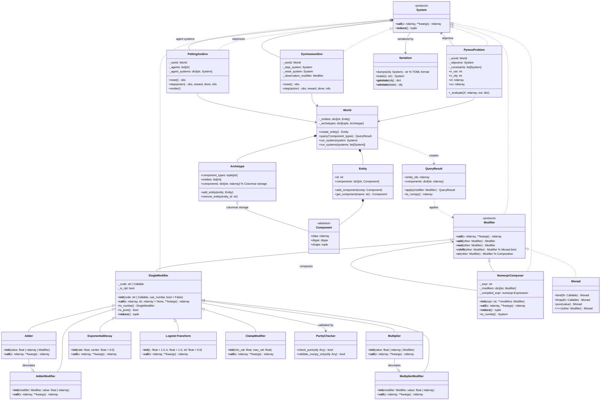

# EcoSim: A Numerical Design Framework for Evolutionary Game Simulation

> *Where pymoo meets Gymnasium/PettingZoo, accelerated by Numba and ECS*

## Related Work

Before diving into the design, it's valuable to situate EcoSim within the existing ecosystem:

- **[pymoo](https://pymoo.org)** is a comprehensive Python framework for single- and multi-objective optimization with emphasis on evolutionary and population-based methods. It provides ready-to-use algorithms (NSGA-II/III, MOEA/D, SPEA2) and customizable genetic operators. pymoo's core architecture provides essential building blocks for problem definition, solution representation, and optimization execution.

- **[pysamoo](https://anyoptimization.com/projects/pysamoo/)** extends pymoo with surrogate-assisted optimization for computationally expensive problems. It is released under the AGPL license—a choice we adopt for EcoSim.

- **Gymnasium** and **PettingZoo** provide API standards for single-agent and multi-agent reinforcement learning environments respectively. PettingZoo uses the Agent Environment Cycle (AEC) game model.

- **Numba** accelerates numerical functions via JIT compilation, generating optimized machine code from pure Python. Projects like [NREL/DE](https://github.com/NREL/DE) demonstrate Numba-compatible self-adaptive differential evolution.

- **ECS (Entity-Component-System)** patterns in Python/NumPy are emerging for simulation optimization, with projects like [MicroECS](https://github.com) storing data in columnar NumPy arrays and [ecs-dsl](https://github.com/uwm-se/ecs-dsl) compiling ECS programs to GPU backends.

EcoSim synthesizes these ideas into a cohesive framework: pymoo's optimization algorithms, Gymnasium/PettingZoo's environment APIs, Numba's acceleration, ECS's data-oriented design, and a novel **Modifier System** for building composable, serializable numerical transformations.

---

## Mermaid Class Diagram



---

# README

# EcoSim: Evolutionary Computation + ECS Simulation Framework

[](https://www.gnu.org/licenses/agpl-3.0)
[](https://www.python.org/downloads/)
[](https://numba.pydata.org/)

**EcoSim** is a numerical design framework that combines multi-objective optimization (pymoo), reinforcement learning environments (Gymnasium/PettingZoo), and high-performance simulation via Entity-Component-System (ECS) architecture with Numba acceleration.

## ✨ Features

- **🧩 ECS Core**: Entity-Component-System architecture with NumPy-backed columnar storage for cache-efficient batch processing
- **⚡ Numba Acceleration**: JIT-compiled systems for near-C performance
- **🎯 Modifier System**: Build complex numerical transformations via arithmetic composition (`+`, `*`, `>>=`, `|`)
- **📦 Serializable Systems**: All systems serialize to human-readable TOML format via custom pickle magic
- **🔍 Purity Checking**: Automatic verification that systems operate only on NumPy arrays
- **🎮 Gymnasium/PettingZoo Integration**: Native support for single-agent and multi-agent RL environments
- **🧬 pymoo Integration**: Use ECS systems as objective functions for evolutionary optimization
- **📐 Monad Construction**: Haskell-style `>>=` (bind) for composable, side-effect-free transformations

## 📦 Installation

```bash
# Using uv (recommended)
uv init --packages my_project
uv add eco-sim

# Or with pip
pip install eco-sim
```

## 🚀 Quick Start

### 1. Define a Simple Modifier

```python
import numpy as np
from eco_sim import Adder, Multiplier, ExponentialDecay

# Basic modifiers
shift = Adder(5.0)              # x -> x + 5
scale = Multiplier(2.0)         # x -> x * 2
decay = ExponentialDecay(0.1)   # x -> x * exp(-0.1 * x)

# Compose via arithmetic
system = (shift + scale) * decay
# Equivalent to: decay(shift(x) + scale(x))

# Apply to data
x = np.array([1.0, 2.0, 3.0])
result = system(x)
```

### 2. Build with NumexprComposer

```python
from eco_sim import NumexprComposer, Adder, Multiplier

modifiers = {
    'a': Adder(1.0),
    'b': Multiplier(2.0),
}

# Efficient expression composition
system = NumexprComposer(
    'a(x) + b(x) * 3.0',
    **modifiers
)

result = system(np.array([1.0, 2.0, 3.0]))
```

### 3. ECS World with Systems

```python
from eco_sim import World, Entity, Component, QueryResult

# Create world
world = World()

# Define a system (pure NumPy function)
@system
def velocity_update(position: np.ndarray, velocity: np.ndarray) -> np.ndarray:
    return position + velocity * dt

# Or use a Modifier
from eco_sim import Adder
move_system = Adder(np.array([0.1, 0.0]))

# Run system on all entities with matching components
world.run_system(move_system)
```

### 4. Integrate with pymoo

```python
from eco_sim import PymooProblem
from pymoo.algorithms.moo.nsga2 import NSGA2
from pymoo.optimize import minimize

# Define objective using Modifiers
objective = NumexprComposer(
    'x**2 + sin(y) + z',
    x=Adder(0.0),
    y=Multiplier(1.0),
    z=ExponentialDecay(0.5)
)

problem = PymooProblem(
    objective=objective,
    n_var=3,
    xl=np.array([-5, -5, -5]),
    xu=np.array([5, 5, 5]),
    n_obj=1
)

algorithm = NSGA2(pop_size=100)
res = minimize(problem, algorithm, ('n_gen', 50))
```

### 5. Gymnasium Environment

```python
from eco_sim import GymnasiumEnv, World, Modifier

world = World()
# ... setup entities ...

step_system = NumexprComposer('state + action', state=world.state, action=...)
reset_system = ...

env = GymnasiumEnv(
    world=world,
    step_system=step_system,
    reset_system=reset_system,
    observation_modifier=Adder(0.0)
)

obs, info = env.reset()
obs, reward, done, info = env.step(action)
```

### 6. Monad Chaining

```python
from eco_sim import Monad, Adder, Multiplier

# Create a monad from a modifier
m = Monad.pure(Adder(1.0))

# Chain transformations
result = (m
    .bind(lambda x: Multiplier(2.0)(x))
    .bind(lambda x: ExponentialDecay(0.1)(x))
)

# Or use the >>= operator
chained = Adder(1.0) >>= Multiplier(2.0) >>= ExponentialDecay(0.1)
```

### 7. Serialization

```python
from eco_sim import Serializer

system = Adder(5.0) + Multiplier(2.0)

# Serialize to TOML (human-readable)
toml_str = Serializer.dumps(system)
print(toml_str)
# [system]
# type = "NumexprComposer"
# expr = "a(x) + b(x)"
# [system.modifiers.a]
# type = "Adder"
# value = 5.0
# [system.modifiers.b]
# type = "Multiplier"
# value = 2.0

# Deserialize
restored = Serializer.loads(toml_str)
assert np.allclose(system(np.array([1.0])), restored(np.array([1.0])))
```

## 🏗️ Architecture

### Core Concepts

#### System
A protocol that MUST be either:
1. A pure serializable callable accepting and returning NumPy arrays (batch processing)
2. A `numba.njit`-ted function

#### Modifier
Any function taking a position-only NumPy array `x`, optional `**kwargs` arrays as context, returning a NumPy array of the same shape.

#### SingleModifier
A `Modifier` with a mandatory `dx` keyword argument (broadcastable to input). Accepts Python lambda/def blocks that perform the modification.

#### Adder & Multiplier
Specialized `SingleModifier` instances for addition and multiplication operations.

#### NumexprComposer
A `System` that composes `Modifier`s efficiently using `numexpr` expressions.

### ECS Implementation

- **Components**: NumPy arrays stored in columnar format for cache efficiency
- **Entities**: Lightweight IDs referencing component data
- **Archetypes**: Groups of entities sharing component types for optimal query performance
- **World**: Manages entities, components, and system execution
- **Queries**: Return `QueryResult` objects with vectorized NumPy operations

### Purity & Serialization

- **PurityChecker**: Validates that systems only use NumPy operations (no I/O, no Python objects)
- **Serializer**: Implements custom pickle magic to serialize to TOML format
- All systems are `pickle`-compatible with human-readable representation

### Monad Implementation

Inspired by Haskell, EcoSim implements:

- `>>=` (bind): Chain modifiers while preserving context
- `fmap`: Apply a function to the result of a modifier
- `pure`: Lift a value into the monad

## 🧪 Development

```bash
# Clone and install
git clone https://github.com/your-username/eco-sim.git
cd eco-sim
uv sync

# Run tests
pytest tests/

# Type check
mypy src/

# Format
black src/ tests/
```

## 📄 License

EcoSim is released under the **GNU Affero General Public License (AGPL) v3**. This choice aligns with projects like pysamoo that extend pymoo and ensures that modifications to the framework remain open source.

## 🤝 Contributing

Contributions are welcome! Please see [CONTRIBUTING.md](CONTRIBUTING.md) for guidelines.

1. Fork the repository
2. Create a feature branch
3. Add tests for new functionality
4. Ensure all tests pass
5. Submit a pull request

## 📚 References

- [pymoo: Multi-objective Optimization in Python](https://pymoo.org)
- [pysamoo: Surrogate-Assisted Multi-Objective Optimization](https://anyoptimization.com/projects/pysamoo/)
- [Gymnasium: Single-Agent RL API](https://gymnasium.farama.org/)
- [PettingZoo: Multi-Agent RL API](https://pettingzoo.farama.org/)
- [Numba: NumPy-aware JIT Compiler](https://numba.pydata.org/)
- [MicroECS: ECS in Python/NumPy](https://github.com)

## 🏷️ Keywords

`pymoo` `gymnasium` `pettingzoo` `numba` `ecs` `entity-component-system` `evolutionary-computation` `multi-objective-optimization` `reinforcement-learning` `numerical-simulation` `modifier-system` `monad` `serialization`
